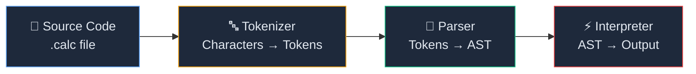
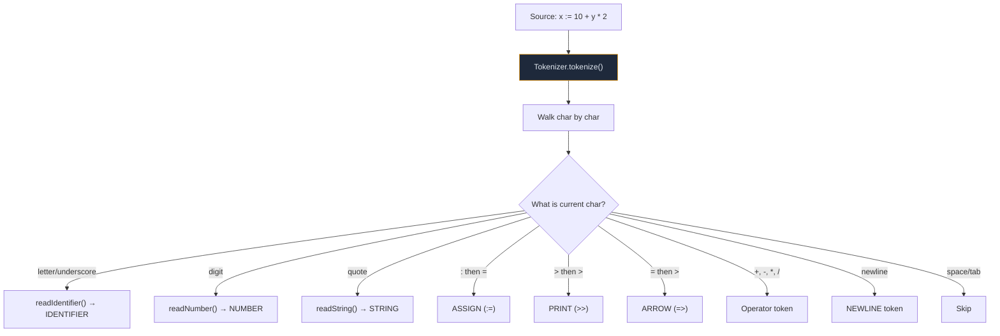
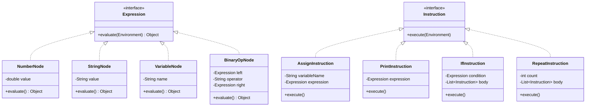
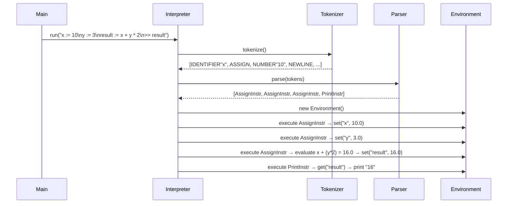

# 🧮 CALC Mini Scripting Engine — Complete Walkthrough

> **Sitare University | Advanced OOP in Java**
> Build Your Own Mini Scripting Engine

---

## 1. Project Overview

The CALC engine is a **complete interpreter** for a custom toy programming language called **CALC**. Given a [.calc](file:///c:/Users/adity/OneDrive/Desktop/Java_Project/program2.calc) source file, it reads the code, breaks it into tokens, builds a tree of instructions, and executes them — all in pure Java with zero external dependencies.

### The Three-Stage Pipeline



| Stage | Input | Output | Key Class |
|-------|-------|--------|-----------|
| **Tokenize** | Raw source string | `List<Token>` | [Tokenizer](file:///c:/Users/adity/OneDrive/Desktop/Java_Project/tokens/Tokenizer.java#11-208) |
| **Parse** | `List<Token>` | `List<Instruction>` | [Parser](file:///c:/Users/adity/OneDrive/Desktop/Java_Project/runtime/Parser.java#21-302) |
| **Execute** | `List<Instruction>` | Console output | [Interpreter](file:///c:/Users/adity/OneDrive/Desktop/Java_Project/runtime/Interpreter.java#13-37) + [Environment](file:///c:/Users/adity/OneDrive/Desktop/Java_Project/runtime/Environment.java#11-32) |

---

## 2. File / Class Map

The project consists of **14 Java source files** organized into 4 logical layers:

```
Java_Project/
├── Main.java                      ← Entry point (reads file, kicks off Interpreter)
│
├── tokens/                        (package tokens)
│   ├── TokenType.java             ← Enum of all token kinds
│   ├── Token.java                 ← Immutable token record
│   └── Tokenizer.java             ← Scans characters → List<Token>
│
├── ast/                           (package ast)
│   ├── Expression.java            ← Interface: evaluate(Environment) → Object
│   ├── NumberNode.java            ← Leaf: literal number (42, 3.14)
│   ├── StringNode.java            ← Leaf: literal string ("hello")
│   ├── VariableNode.java          ← Leaf: variable reference (x, total)
│   └── BinaryOpNode.java          ← Branch: left OP right (+, -, *, /, >, <, ==)
│
├── instructions/                  (package instructions)
│   ├── Instruction.java           ← Interface: execute(Environment)
│   ├── AssignInstruction.java     ← x := expression
│   ├── PrintInstruction.java      ← >> expression
│   ├── IfInstruction.java         ← ? condition => body
│   └── RepeatInstruction.java     ← @ count => body
│
├── runtime/                       (package runtime)
│   ├── Environment.java           ← Variable store (state)
│   ├── Parser.java                ← Tokens → AST
│   └── Interpreter.java           ← Orchestrates pipeline
│
└── programs/                      (scripts)
    ├── program1.calc              ← Arithmetic & variables
    ├── program2.calc              ← String output
    ├── program3.calc              ← Conditional
    └── program4.calc              ← Loop
```

---

## 3. CALC Language Syntax

| Feature | Syntax | Example |
|---------|--------|---------|
| **Assignment** | `variable := expression` | `x := 10 + 5` |
| **Print** | `>> expression` | `>> x` or `>> "hello"` |
| **Conditional** | `? condition =>`<br/>&nbsp;&nbsp;&nbsp;&nbsp;`body` | `? x > 5 =>`<br/>&nbsp;&nbsp;&nbsp;&nbsp;`>> "big"` |
| **Loop** | `@ count =>`<br/>&nbsp;&nbsp;&nbsp;&nbsp;`body` | `@ 3 =>`<br/>&nbsp;&nbsp;&nbsp;&nbsp;`>> "hi"` |
| **Arithmetic** | `+  -  *  /` | `x + y * 2` |
| **Comparison** | `>  <  ==` | `score > 50` |
| **Comment** | `# text` | `# this is ignored` |

### Operator Precedence (lowest → highest)

| Level | Operators | Example |
|-------|-----------|---------|
| 1 (lowest) | `>`, `<`, `==` | `x > 5` |
| 2 | `+`, `-` | `x + y` |
| 3 (highest) | `*`, `/` | `y * 2` |

> [!IMPORTANT]
> Due to precedence rules, `x + y * 2` is evaluated as `x + (y * 2)`, **not** [(x + y) * 2](file:///c:/Users/adity/OneDrive/Desktop/Java_Project/runtime/Environment.java#14-20).

---

## 4. Stage 1 — Tokenization

### Purpose

The [Tokenizer](file:///c:/Users/adity/OneDrive/Desktop/Java_Project/tokens/Tokenizer.java#11-208) class walks through the raw source string **character by character** and produces a `List<Token>`. Each [Token](file:///c:/Users/adity/OneDrive/Desktop/Java_Project/tokens/Token.java#7-35) holds three things:

- **TokenType** — one of 16 enum values (e.g., `NUMBER`, `PLUS`, `ASSIGN`)
- **Value** — the raw text that made up this token
- **Line number** — for error reporting

### How It Works



### Token Types

Defined in [TokenType.java](file:///c:/Users/adity/OneDrive/Desktop/Java_Project/TokenType.java):

| Category | Types |
|----------|-------|
| **Literals** | `NUMBER`, `STRING`, `IDENTIFIER` |
| **Arithmetic** | `PLUS` (+), `MINUS` (-), `STAR` (*), `SLASH` (/) |
| **Comparison** | `GT` (>), `LT` (<), `EQ_EQ` (==) |
| **CALC symbols** | `ASSIGN` (:=), `PRINT` (>>), `IF` (?), `REPEAT` (@), `ARROW` (=>) |
| **Structural** | `NEWLINE`, `EOF` |

### Example Trace

For the source `x := 10`:

| Step | Character(s) | Token Produced |
|------|-------------|----------------|
| 1 | `x` | `IDENTIFIER "x"` |
| 2 | ` ` | *(skipped)* |
| 3 | `:=` | `ASSIGN ":="` |
| 4 | ` ` | *(skipped)* |
| 5 | `10` | `NUMBER "10"` |
| 6 | *(end)* | `EOF ""` |

### Key Implementation Details

- **Two-character lookahead**: The [peek()](file:///c:/Users/adity/OneDrive/Desktop/Java_Project/tokens/Tokenizer.java#142-151) method checks the next character without advancing, enabling recognition of `:=`, `>>`, `=>`, and `==`
- **String literals**: [readString()](file:///c:/Users/adity/OneDrive/Desktop/Java_Project/tokens/Tokenizer.java#152-175) consumes everything between `"..."` and throws on unterminated strings
- **Comment support**: Lines starting with `#` are skipped entirely
- **Whitespace handling**: Spaces and tabs are skipped, but newlines produce `NEWLINE` tokens (needed for block parsing)

---

## 5. Stage 2 — Parsing (AST Construction)

### Purpose

The [Parser](file:///c:/Users/adity/OneDrive/Desktop/Java_Project/runtime/Parser.java#21-302) takes the flat `List<Token>` and builds a structured **Abstract Syntax Tree** (AST). The tree has two kinds of nodes:

- **Instructions** — actions to execute ([Assign](file:///c:/Users/adity/OneDrive/Desktop/Java_Project/runtime/Parser.java#71-84), [Print](file:///c:/Users/adity/OneDrive/Desktop/Java_Project/runtime/Parser.java#85-93), [If](file:///c:/Users/adity/OneDrive/Desktop/Java_Project/runtime/Parser.java#94-110), [Repeat](file:///c:/Users/adity/OneDrive/Desktop/Java_Project/runtime/Parser.java#111-133))
- **Expressions** — values to compute ([NumberNode](file:///c:/Users/adity/OneDrive/Desktop/Java_Project/ast/NumberNode.java#8-20), [StringNode](file:///c:/Users/adity/OneDrive/Desktop/Java_Project/ast/StringNode.java#8-20), [VariableNode](file:///c:/Users/adity/OneDrive/Desktop/Java_Project/ast/VariableNode.java#9-21), [BinaryOpNode](file:///c:/Users/adity/OneDrive/Desktop/Java_Project/ast/BinaryOpNode.java#10-62))

### Class Hierarchy



### Recursive Descent Parsing

The parser uses **recursive descent** with three levels for operator precedence:

```
parseExpression()          ← handles  >, <, ==
  └── parseAddition()      ← handles  +, -
        └── parseTerm()    ← handles  *, /
              └── parsePrimary()  ← NUMBER, STRING, IDENTIFIER
```

Each level calls the next-higher-precedence level first, ensuring that `*` and `/` bind tighter than `+` and `-`, which bind tighter than comparisons.

### Example AST

For `result := x + y * 2`:

```
AssignInstruction
├── variableName: "result"
└── expression: BinaryOpNode (+)
    ├── left: VariableNode("x")
    └── right: BinaryOpNode (*)
        ├── left: VariableNode("y")
        └── right: NumberNode(2.0)
```

> [!NOTE]
> `y * 2` is grouped first (higher precedence), then added to `x` — achieving the correct result of `10 + (3 * 2) = 16`.

### Block Parsing (If / Repeat)

The parser identifies body blocks for `?` (if) and `@` (repeat) by checking **line numbers**:

1. After the `=>` arrow, it consumes the `NEWLINE`
2. It then collects all instructions whose line number is **greater than** the header line
3. When it finds a token on the same or earlier line, the block ends

This line-number heuristic enables indentation-based block detection without needing explicit braces or `end` keywords.

---

## 6. Stage 3 — Execution

### The Environment (Variable Store)

[Environment.java](file:///c:/Users/adity/OneDrive/Desktop/Java_Project/Environment.java) is a simple wrapper around `HashMap<String, Object>`:

| Method | Purpose |
|--------|---------|
| [set(name, value)](file:///c:/Users/adity/OneDrive/Desktop/Java_Project/runtime/Environment.java#14-20) | Store/update a variable |
| [get(name)](file:///c:/Users/adity/OneDrive/Desktop/Java_Project/runtime/Environment.java#21-31) | Retrieve a variable (throws if undefined) |

Variables can hold either a `Double` (numbers) or a [String](file:///c:/Users/adity/OneDrive/Desktop/Java_Project/tokens/Token.java#30-34) (text).

### How Each Instruction Executes

| Instruction | What happens at runtime |
|-------------|------------------------|
| [AssignInstruction](file:///c:/Users/adity/OneDrive/Desktop/Java_Project/instructions/AssignInstruction.java#9-24) | Evaluates the expression, stores result via `env.set()` |
| [PrintInstruction](file:///c:/Users/adity/OneDrive/Desktop/Java_Project/instructions/PrintInstruction.java#11-35) | Evaluates the expression, prints to `System.out`. Formats whole numbers without `.0` |
| [IfInstruction](file:///c:/Users/adity/OneDrive/Desktop/Java_Project/instructions/IfInstruction.java#13-33) | Evaluates the condition; if `true`, executes body instructions |
| [RepeatInstruction](file:///c:/Users/adity/OneDrive/Desktop/Java_Project/instructions/RepeatInstruction.java#11-29) | Loops `count` times, executing body instructions each iteration |

### Expression Evaluation

The `BinaryOpNode.evaluate()` method handles:

| Operator | Number × Number | Other Types |
|----------|----------------|-------------|
| `+` | Addition | String concatenation |
| `-` | Subtraction | ❌ Error |
| `*` | Multiplication | ❌ Error |
| `/` | Division (guards against ÷0) | ❌ Error |
| `>`, `<` | Comparison → `Boolean` | ❌ Error |
| `==` | Numeric equality → `Boolean` | Object equality |

### The Interpreter Glue

[Interpreter.java](file:///c:/Users/adity/OneDrive/Desktop/Java_Project/Interpreter.java) ties it all together in **just 3 lines of logic**:

```java
public void run(String sourceCode) {
    List<Token> tokens      = new Tokenizer(sourceCode).tokenize();  // Step 1
    List<Instruction> instr = new Parser(tokens).parse();             // Step 2
    Environment env = new Environment();
    for (Instruction i : instr) i.execute(env);                       // Step 3
}
```

---

## 7. Entry Point — Main.java

[Main.java](file:///c:/Users/adity/OneDrive/Desktop/Java_Project/Main.java) handles:

1. Reading the file path from `args[0]`
2. Loading the file contents into a [String](file:///c:/Users/adity/OneDrive/Desktop/Java_Project/tokens/Token.java#30-34)
3. Passing it to `Interpreter.run()`
4. Catching `IOException` (file not found) and `RuntimeException` (language errors)

**Usage**: `java Main <source-file.calc>`

---

## 8. Test Results — All 4 Programs ✅

### Program 1 — Arithmetic & Variables
**File**: [program1.calc](file:///c:/Users/adity/OneDrive/Desktop/Java_Project/program1.calc)
```
x := 10
y := 3
result := x + y * 2
>> result
```
| Expected | Actual | Status |
|----------|--------|--------|
| `16` | `16` | ✅ Pass |

---

### Program 2 — String Output
**File**: [program2.calc](file:///c:/Users/adity/OneDrive/Desktop/Java_Project/program2.calc)
```
name := "Sitare"
>> name
>> "Hello from CALC"
```
| Expected | Actual | Status |
|----------|--------|--------|
| `Sitare` | `Sitare` | ✅ Pass |
| `Hello from CALC` | `Hello from CALC` | ✅ Pass |

---

### Program 3 — Conditional
**File**: [program3.calc](file:///c:/Users/adity/OneDrive/Desktop/Java_Project/program3.calc)
```
score := 85
? score > 50 =>
    >> "Pass"
```
| Expected | Actual | Status |
|----------|--------|--------|
| `Pass` | `Pass` | ✅ Pass |

---

### Program 4 — Loop
**File**: [program4.calc](file:///c:/Users/adity/OneDrive/Desktop/Java_Project/program4.calc)
```
i := 1
@ 4 =>
    >> i
    i := i + 1
```
| Expected | Actual | Status |
|----------|--------|--------|
| `1` `2` `3` `4` | `1` `2` `3` `4` | ✅ Pass |

---

## 9. OOP Design Patterns Used

| Pattern | Where | Purpose |
|---------|-------|---------|
| **Interface / Polymorphism** | [Expression](file:///c:/Users/adity/OneDrive/Desktop/Java_Project/ast/Expression.java#9-16), [Instruction](file:///c:/Users/adity/OneDrive/Desktop/Java_Project/instructions/Instruction.java#9-15) | All AST nodes share a common contract — the engine calls [evaluate()](file:///c:/Users/adity/OneDrive/Desktop/Java_Project/ast/Expression.java#10-15) or [execute()](file:///c:/Users/adity/OneDrive/Desktop/Java_Project/instructions/AssignInstruction.java#18-23) without knowing the concrete type |
| **Composite** | [IfInstruction](file:///c:/Users/adity/OneDrive/Desktop/Java_Project/instructions/IfInstruction.java#13-33), [RepeatInstruction](file:///c:/Users/adity/OneDrive/Desktop/Java_Project/instructions/RepeatInstruction.java#11-29) | Instructions contain a `List<Instruction>` body, forming a tree structure |
| **Interpreter Pattern** | `BinaryOpNode.evaluate()` | Each node evaluates itself recursively, delegating to child nodes |
| **Immutable Value Objects** | [Token](file:///c:/Users/adity/OneDrive/Desktop/Java_Project/tokens/Token.java#7-35) | Tokens are read-only once created — `final` fields, no setters |
| **Encapsulation** | [Environment](file:///c:/Users/adity/OneDrive/Desktop/Java_Project/runtime/Environment.java#11-32) | Variable storage is hidden behind [get()](file:///c:/Users/adity/OneDrive/Desktop/Java_Project/runtime/Environment.java#21-31)/[set()](file:///c:/Users/adity/OneDrive/Desktop/Java_Project/runtime/Environment.java#14-20) — callers never touch the internal `HashMap` |
| **Single Responsibility** | All classes | Each class does exactly one thing — [Tokenizer](file:///c:/Users/adity/OneDrive/Desktop/Java_Project/tokens/Tokenizer.java#11-208) only scans, [Parser](file:///c:/Users/adity/OneDrive/Desktop/Java_Project/runtime/Parser.java#21-302) only builds the AST, [Interpreter](file:///c:/Users/adity/OneDrive/Desktop/Java_Project/runtime/Interpreter.java#13-37) only orchestrates |

---

## 10. Execution Flow Trace

Here is an end-to-end trace for **Program 1** (`x := 10, y := 3, result := x + y * 2, >> result`):



---

## 11. How to Compile & Run

```bash
# Compile all Java files across packages
javac -d . Main.java tokens/*.java ast/*.java instructions/*.java runtime/*.java

# Run any .calc program from the programs/ folder
java Main programs/program1.calc
java Main programs/program2.calc
java Main programs/program3.calc
java Main programs/program4.calc
```

---

> **Summary**: The CALC Mini Scripting Engine demonstrates core OOP and language-design concepts — tokenization, recursive-descent parsing with operator precedence, AST construction via polymorphism, and tree-walking interpretation — all in a clean, modular, 14-class Java project.
